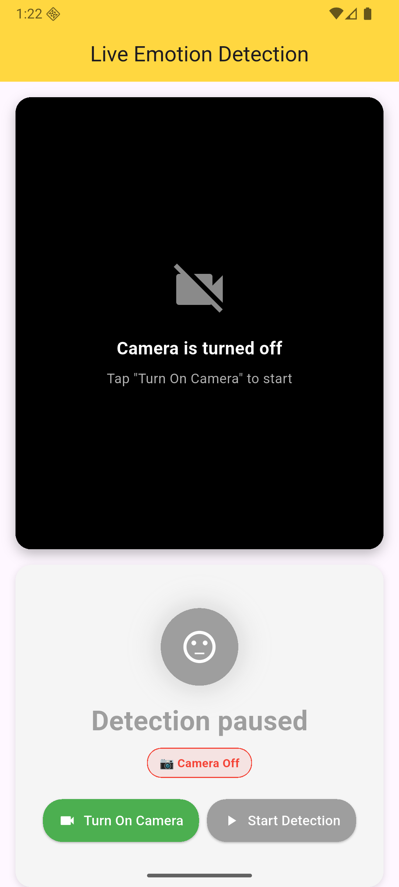
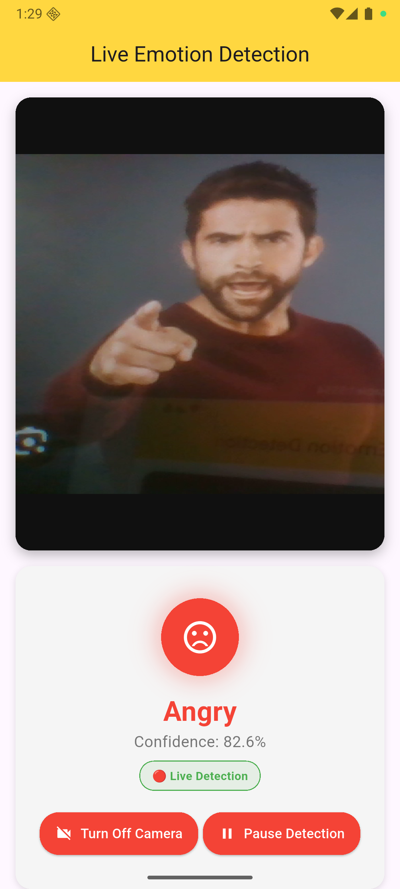
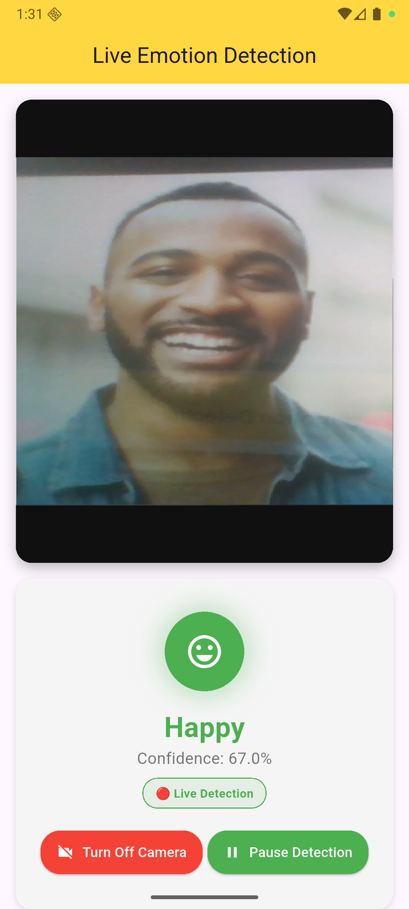

# Live Emotion Detector App

Real-time emotion detection application built using **Flutter** and **TensorFlow Lite**.
- Live Camera Feed Analysis  
- Real-time Emotion Recognition  
- AI-Powered Facial Expression Detection

## Tech Stack

- **Flutter** (UI Framework)  
- **TensorFlow Lite** (ML Model Inference)  
- **Camera Plugin** (Live Camera Feed)  
- **Custom CNN Model** (Emotion Detection)  

## Screenshots

<div align="left">
  
  
  
</div>

## Dependencies

```yaml
camera: ^0.10.5+5
tflite_flutter: ^0.11.0
cupertino_icons: ^1.0.8
flutter_lints: ^5.0.0
```